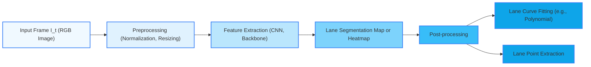

# **Lane tracking for Autonomous Driving and/or ADAS systems**

## **Problem Formulation & Understanding**

### **Definition of the problem**

How to keep `lane tracking` models **reliable** on **non-standardized roads**, using only RGB camera input?
### **Constraints**

The following are the initial constraints considered in this study. Additional constraints may emerge as the research progresses and deeper insights are gained.

#### 🔧 **Computational Constraints**
- **Deployment Environment**  
  The model is intended to run on **edge devices** (e.g., onboard units, embedded systems like Jetson Nano or Xavier), where resources are limited compared to cloud-based solutions.

- **Latency Requirements**  
  - **Inference latency** must be low enough to meet real-time performance standards, especially in high-speed driving scenarios.  
  - **Cloud processing** introduces **communication latency**, which is **unacceptable in safety-critical applications** due to network unreliability or disconnection risk.

- **Connectivity Limitations**  
  - **Unreliable or unavailable network access** in rural or remote areas makes **cloud-based inference impractical**.  
  - Emphasizes the need for **offline, self-contained processing** capabilities.

#### 📉 **Resource Efficiency**
- The solution should consider:
  - **Low power consumption** (important for embedded/ADAS platforms)  
  - **Memory footprint** and **model size**, especially for deployment on lightweight hardware.

### **Scope**

This section outlines the initial boundaries of the project. It defines what will be addressed (**in-scope**) and what is currently considered outside the project's scope (**out-of-scope**). These boundaries may evolve as the research progresses.

#### ✅ **In-Scope**
- **Lane tracking using monocular RGB camera data**
- **Focus on challenging environments**, including:
  - Non-standardized roads (e.g., rural, unmarked, or damaged)
  - Variable lighting and weather conditions
- **Evaluation of robustness and generalization** of selected models
- **Edge deployment constraints**, including:
  - Inference latency
  - Model size and efficiency
- Comparison of multiple model architectures (classical and deep learning-based)

#### ❌ **Out-of-Scope (Initial Phase)**
- Use of additional sensor modalities (e.g., LiDAR, radar, stereo vision)
- End-to-end driving policies or full autonomous driving stacks
- High-definition map fusion or GPS/IMU integration
- Cloud-based inference or distributed computing systems
- Real-world deployment (focus will be on simulation or benchmark datasets)

### **Mathematical Formulation**

We formulate the lane tracking task as a **structured perception problem** where the goal is to estimate the geometry of lane markings in an image sequence, given only monocular RGB input.

Let:
- \( I_t \in \mathbb{R}^{H \times W \times 3} \) be the RGB frame captured at time \( t \)
- \( \mathcal{I}_{1:T} = \{I_1, I_2, ..., I_T\} \) be a sequence of image frames
- \( \mathcal{L}_t = \{l_{t,1}, ..., l_{t,N_t}\} \) be the set of lane markings present in frame \( I_t \), where each lane \( l_{t,i} \) can be represented as:
  - A **curve**: \( l_{t,i}(x) = a_i x^2 + b_i x + c_i \)
  - Or a **set of points**: \( l_{t,i} = \{(x_j, y_j)\}_{j=1}^{M} \)

#### **Objective**
Given an input frame \( I_t \), estimate \( \mathcal{L}_t \) such that:
- The predicted lane markings align with the ground truth labels (if available)
- The geometry is consistent across frames (temporal coherence)

Mathematically, the model \( f_\theta \) is trained to minimize a loss function \( \mathcal{L} \), for example:

\[
f_\theta: I_t \rightarrow \hat{\mathcal{L}}_t \quad \text{such that} \quad \mathcal{L} = \mathcal{L}_{\text{seg}} + \lambda \mathcal{L}_{\text{geom}} + \mu \mathcal{L}_{\text{temporal}}
\]

Where:
- \( \mathcal{L}_{\text{seg}} \): segmentation loss (e.g., binary cross-entropy for lane pixels)
- \( \mathcal{L}_{\text{geom}} \): geometric consistency (e.g., smoothness or polynomial fitting loss)
- \( \mathcal{L}_{\text{temporal}} \): temporal consistency loss (optional, if using video)

#### **Optional Extensions**
- Use a **graph-based representation** where lanes are modeled as nodes and relationships (e.g., continuity, parallelism) as edges.
- Incorporate a **state vector** \( s_t \) to track the estimated position of the lanes across time, enabling **Kalman filtering** or other temporal models.

---

### **Lane Tracking Pipeline – Diagram**

## **Literature Review & Prior Knowledge**
A list of papers studied for this project:
- [RONELDV2](./2202.13137v1.pdf)